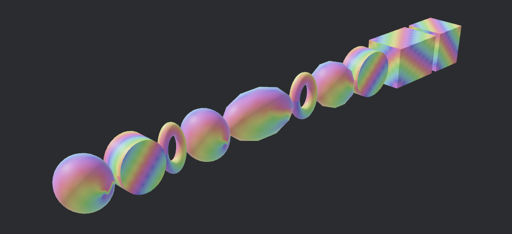
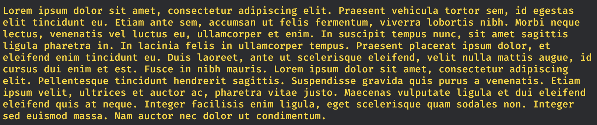

# bevy_rectray

A minimal 2d layout system (that works in 3d!) for bevy.

[](https://crates.io/crates/bevy_rectray)
[](https://docs.rs/bevy_rectray/latest/bevy_rectray/)
[](https://bevyengine.org/learn/book/plugin-development/)

## Getting Started

First add `RectrayPlugin`.

```rust
app.add_plugins(RectrayPlugin)
```

Then add `RectrayFrame` to a parent entity.
This effectively creates a 2d rectangular space around
the local `x` and `y` axis of the entity's `Transform`.

```rust
commands.spawn(
    SpacialBundle {
        ...
    },
    RectrayFrame::from_dimension(Vec2::new(1024., 768.)),
)
```

To place descendant entities inside the frame, add `RectrayBundle` next to entities
with `TransformBundles`.

```rust
commands.spawn(
    PbrBundle {
        ...
    },
    RectrayBundle {
        ...
    }
)
```

Since we only operate on `Transform`, `bevy_rectray`
works in `Transform - Transform2d - Transform` sandwich situations.

## Integration

`bevy_rectray` is minimal and does not magically react to changes in bevy components.
We take in `Transform2D` and `Dimension` and produces `Transform`
and `RotatedRect`.

Some of those data can come from external sources.
For example if you want to make all `Sprite`s take up space of its `Image` or `custom_size`,
add a system like this manually:

```rust
pub fn update_sprite_dimension(
    scaling_factor: Query<&Window, With<PrimaryWindow>>,
    mut query: Query<(&mut Sprite, &Handle<Image>, &mut Dimension)>,
    assets: Res<Assets<Image>>
) {
    let scaling_factor = scaling_factor
         .get_single()
         .map(|x| x.scale_factor())
         .unwrap_or(1.0);
    query.iter_mut().for_each(|(sp, im, mut dimension)| {
        dimension.0 = sp.custom_size.or_else(|| {
            sp.rect.map(|rect| (rect.max - rect.min) * scaling_factor)
                .or_else(|| {
                    assets.get(im)
                        .map(|x|x.size().as_vec2() * scaling_factor)
                })
        }).unwrap_or(Vec2::ZERO)
    })
}
```

If you want the opposite behavior, you can update the size of a sprite from
the outputted `RotatedRect::dimension`.

## Containers

Add `RectrayContainerBundle` to put child items in a `Layout`.
See module level documentation for details.

## Showcase

* Place items on anchors of parents


* Put 3d meshes in a layout



* Place individual words to form a paragraph



## Versions

| bevy | bevy_rectray |
|------|--------------|
| 0.14 | latest       |

## License

Licensed under either of

* Apache License, Version 2.0 ([LICENSE-APACHE](LICENSE-APACHE) or <http://www.apache.org/licenses/LICENSE-2.0>)
* MIT license ([LICENSE-MIT](LICENSE-MIT) or <http://opensource.org/licenses/MIT>)

at your option.

### Contribution

Unless you explicitly state otherwise, any contribution intentionally submitted
for inclusion in the work by you, as defined in the Apache-2.0 license, shall be dual licensed as above, without any
additional terms or conditions.
